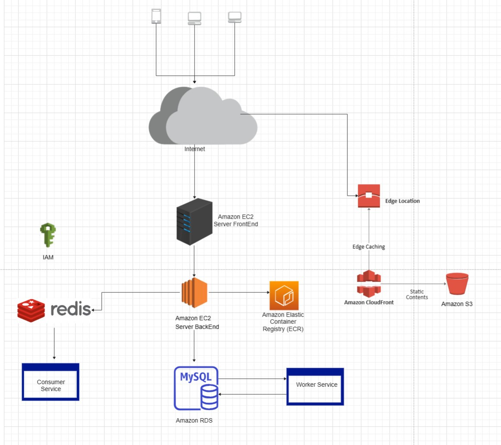

# iTask
# Hướng Dẫn Cài Đặt Ứng Dụng BackEnd

Hướng dẫn này cung cấp các bước chi tiết để thiết lập và chạy ứng dụng BackEnd sử dụng Docker và Docker Compose. Ứng dụng bao gồm ba thành phần chính: dịch vụ BackEnd, cơ sở dữ liệu MySQL và bộ nhớ đệm Redis.

## Yêu Cầu Cần Thiết

Trước khi bắt đầu, hãy đảm bảo bạn đã cài đặt các thành phần sau trên hệ thống của mình:
- [Docker](https://docs.docker.com/engine/install/)
- [Docker Compose](https://docs.docker.com/compose/install/)

## Các Bước Cài Đặt

### Bước 1: Cài Đặt Docker

Theo dõi hướng dẫn trong tài liệu của Docker để cài đặt Docker cho hệ điều hành cụ thể của bạn:
- Hướng dẫn cài đặt Docker: [https://docs.docker.com/engine/install/](https://docs.docker.com/engine/install/)

### Bước 2: Cài Đặt Docker Compose

Sau khi cài đặt Docker, tiếp tục cài đặt Docker Compose theo hướng dẫn trong tài liệu của Docker:
- Hướng dẫn cài đặt Docker Compose: [https://docs.docker.com/compose/install/](https://docs.docker.com/compose/install/)

### Bước 3: Chạy Ứng Dụng

1. Mở terminal.
2. Di chuyển đến thư mục của ứng dụng:
   ```bash
   cd path/to/your/application

### Bước 4: Thực thi lệnh sau để khởi động ứng dụng sử dụng Docker Compose
   ```bash
    docker compose up -d
   ```
   - Ứng dụng sẽ chạy dưới port 8080 ở localhost, và đường dẫn export của API ra ngoài là http://localhost:8080/api/v1/

## Kiến Trúc Hệ Thống 

